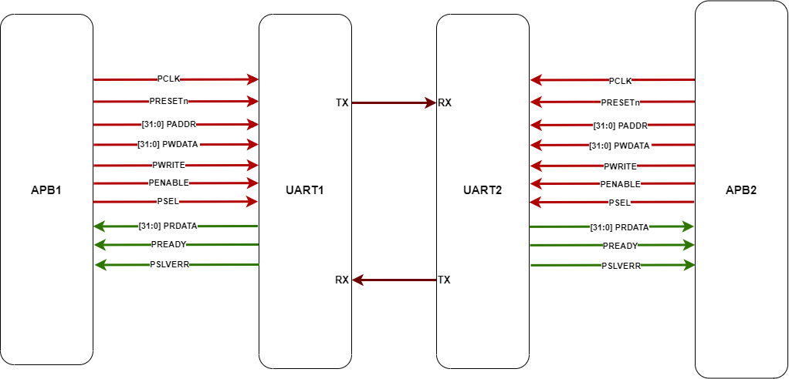
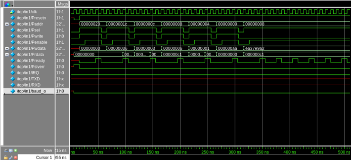

# APB-UART (UART16550) Functional Verification using UVM RAL

## Project Overview
This repository contains a **UVM-based functional verification environment** for an **AMBA APB–connected UART (UART16550-compatible) IP core**, with a **register-centric verification strategy built using the UVM Register Abstraction Layer (RAL)**.

The project verifies **UART register programming, data transfer, interrupt handling, and error reporting** using **RAL-driven stimulus, RAL-mirrored checking, and extensive backdoor register access**.  
Two APB-based UART instances are verified in a back-to-back configuration to support **full-duplex, half-duplex, and loopback modes**.

---

## Design Under Test (DUT)
- Two UART16550-compatible instances: **UART1 and UART2**
- Each UART acts as an **APB slave**
- UART1.TX connected to UART2.RX and UART2.TX connected to UART1.RX
- Independent baud-rate and frame-format configuration
- Complete UART16550-style register map implementation
- 
## Verification plan:

---

## Verification Focus: UVM RAL with Backdoor Access
The verification environment is **fully driven by a UVM RAL model**, which serves as the **single source of truth** for all UART register behavior.

### RAL Model Coverage
The RAL model represents the complete UART register map, including:
- RBR / THR – Receive / Transmit data
- IER – Interrupt Enable Register
- IIR – Interrupt Identification Register
- FCR – FIFO Control Register
- LCR – Line Control Register
- MCR – Modem Control Register
- LSR – Line Status Register
- DLL / DLH – Baud-rate divisor registers

---

## Role of Backdoor Access
Backdoor access is used extensively to **improve accuracy, performance, and observability** during verification:

- Direct backdoor reads of UART registers for **cycle-accurate validation**
- Scoreboard compares monitored APB transactions against **RAL backdoor values**
- Enables precise checking of:
  - Status flags (LSR)
  - Interrupt causes (IIR)
  - Control register updates (LCR, MCR, FCR)
- Allows validation of internal DUT state **without perturbing bus activity**
- Accelerates test execution by avoiding unnecessary frontdoor APB reads

The combination of **RAL mirroring and backdoor access** ensures strong correlation between **expected register state and actual DUT behavior**.

---

## Verification Scope
The following functionality is verified using **RAL-driven sequences and backdoor checking**:

- APB register read/write correctness
- UART transmit and receive paths
- Baud-rate configuration via DLL/DLH
- Frame format programming via LCR
- Interrupt enable, generation, and clearing via IER/IIR
- FIFO and modem control via FCR/MCR
- Status reporting and error flags via LSR
- Error detection:
  - Parity error
  - Framing error
  - Overrun error
  - Break interrupt

---

## Testbench Architecture
The verification environment follows a **modular UVM architecture tightly integrated with RAL**:

- Test layer configures UART behavior exclusively through RAL APIs
- Environment instantiates:
  - Two symmetric APB-UART UVM agents
  - Virtual sequencer coordinating cross-UART scenarios
  - Central RAL-aware scoreboard
- Each agent contains:
  - APB driver
  - APB monitor
  - Sequencer
- Monitors publish APB transactions via analysis ports
- Scoreboard validates:
  - UART data integrity
  - Interrupt behavior
  - Register state using RAL mirrors and backdoor reads

---

## Testbench Architecture Diagram

## Waveform

