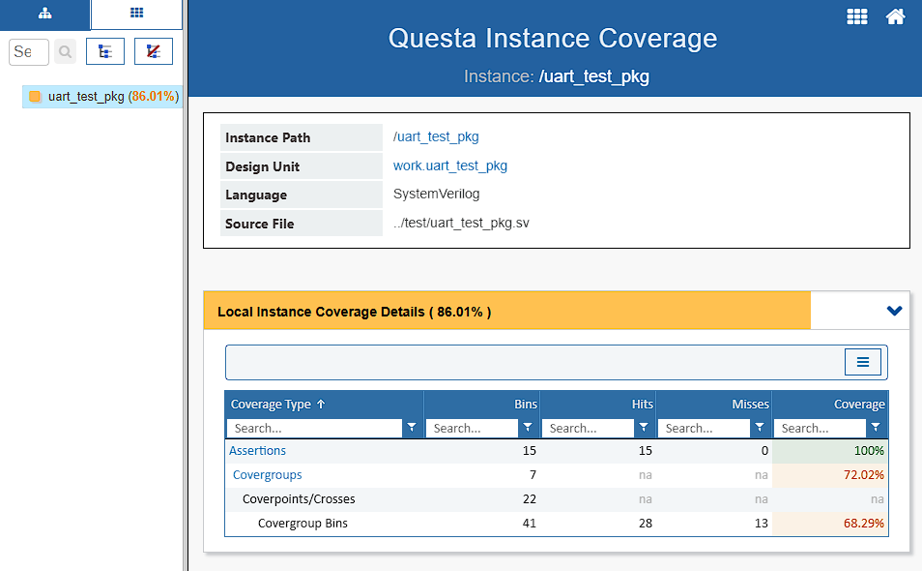

# APB-UART (UART16550) Functional Verification using UVM

## Project Overview
This repository contains a **UVM-based functional verification environment** for an **AMBA APB–connected UART (UART16550-compatible) IP core**.  
The project verifies UART data transfer, register programming, interrupt behavior, and error handling using a **self-checking UVM testbench**.

Two APB-based UART instances are verified in a back-to-back configuration to support **full-duplex, half-duplex, and loopback operation**.

---

## Design Under Test (DUT)
- Two UART16550-compatible instances: **UART1 and UART2**
- Each UART operates as an **APB slave**
- UART1.TX connected to UART2.RX and UART2.TX connected to UART1.RX
- Independent configuration of baud rate and frame format
- Standard UART16550 register map
- 

---

## Verification Scope
The verification environment covers:

- APB register read/write operations
- UART transmit and receive functionality
- Full-duplex communication
- Half-duplex communication
- Loopback mode
- Interrupt generation and handling
- Status register updates (LSR, IIR, MSR)
- UART error detection:
  - Parity error
  - Framing error
  - Overrun error
  - Break interrupt

---

## Testbench Architecture
The testbench follows a **layered UVM architecture**:

- Test configures and runs verification scenarios
- Environment instantiates:
  - Two symmetric APB-UART UVM agents
  - Virtual sequencer for coordinated operation
  - Central scoreboard
- Each agent includes:
  - Sequencer
  - APB driver
  - APB monitor
- Monitors publish observed transactions to the scoreboard for checking

---

## RAL-Based Scoreboard
- The scoreboard integrates a **UVM RAL model** representing the UART register map
- Register values observed on the APB interface are compared against **RAL-mirrored values**
- **Backdoor register reads** are used for status and interrupt validation where required
- Data integrity is verified across UART transmit and receive paths

---

## Test Scenarios
- UART transmit and receive tests
- Full-duplex data transfer between UART1 and UART2
- Half-duplex operation
- Loopback mode verification
- Interrupt generation and clearing
- UART error condition validation

---

## Sample Waveforms

---

## Functional Coverage
- Register configuration coverage
- Interrupt type coverage
- Error condition coverage
- Mode coverage (full-duplex, half-duplex, loopback)

